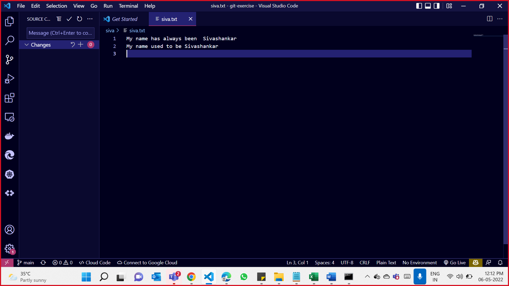
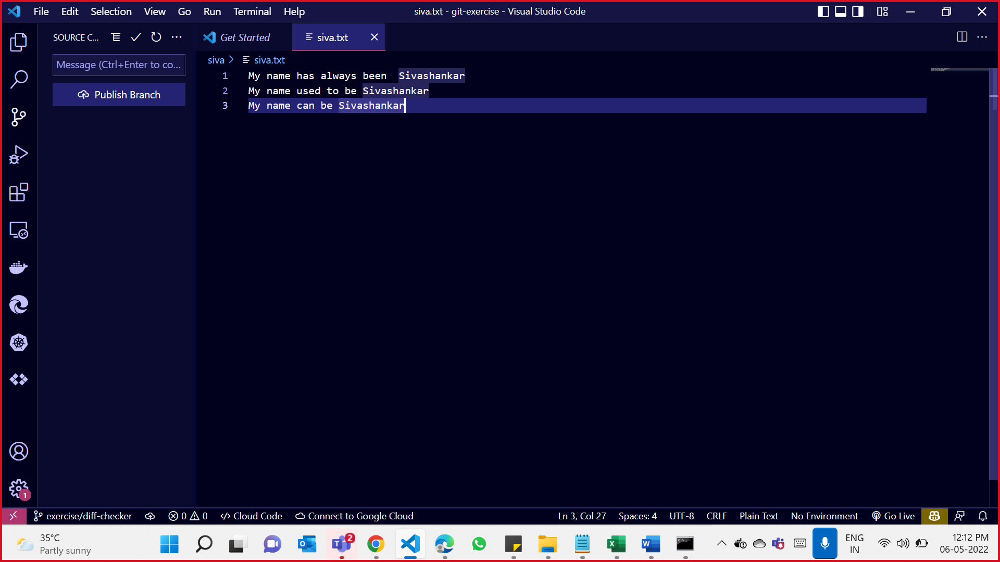

# git-exercise

This is Git exercise for practice.


# Project Structure
```

├── README.md          <- The top-level README for developers using this project.
│   
├── docs               <-  project docs - GIT.docx; 
│
├── screenshots        <- This folder contain screenshots for this project repo
│
├── siva               <- Contains siva.txt file

```

##  Main Git Commands used for this project

```
# To clone the gitlab locally
git clone git@gitlab.com:siva001/git-exercise.git

# Navigate to downloaded repo
cd git-exercise

# To check the status
git status

# To create a file
touch siva.txt

# To stage the created file on the created folder as per Scenario 1
git add siva/siva.txt

# To commit the staged file
git commit -m "Commit Messages" 

# To push the changes from local to remote repository
git push orgin master

# To create a branch name exercise/conflict-resolution as per Scenario 3
git branch exercise/conflict-resolution
git checkout exercise/conflict-resolution

# To push this newly created branch to remote repo
git push origin exercise/conflict-resolution

# To create a new branch named exercise/diff-checker as per Scenario 4
git branch exercise/diff-checker
git checkout exercise/diff-checker

# To delete a branch locally 
git branch -D exercise/diff-checker

# To delete the branch on remote repo
git push origin --delete exercise/diff-checker

# To create a branch named  exercise/stash-scenario from main branch  as per Scenario 6
git checkout -b exercise/stash-scenario main

# To Tag "1.0.0" as per Scenario 9
git tag 1.0.0

```


## As per Scenario 4, attaching the screenshots of  siva.txt file presents in Main branch and exercise/diff-checker branch

1. Branch Name : main 
2. File name : siva.txt 



1. Branch Name : exercise/diff-checker
2. File name : siva.txt 


